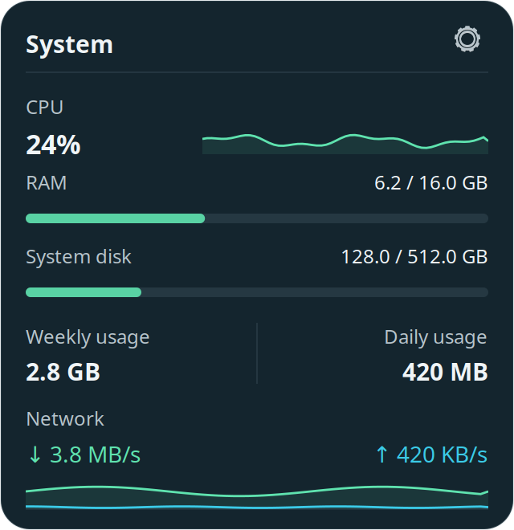
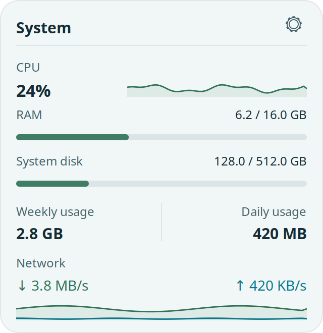
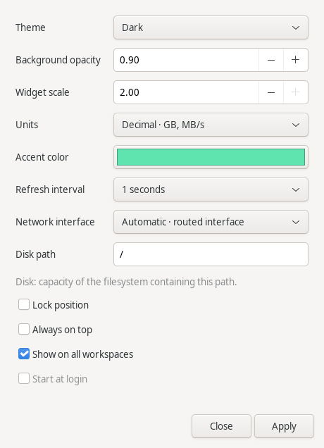

# TallyDesklet

A compact desktop widget for live CPU, memory, disk, network speed, and daily
and weekly data usage. Built with Python 3, GTK 3, Cairo, and psutil for Xfce
on X11. Measurements and preferences stay on your computer.

TallyDesklet is an independent project, not an official Linux Mint product.
Current version: **0.2.1**.

[Download v0.2.1](https://github.com/saeedt20/tallydesklet/releases/tag/v0.2.1)
· [Installation](#install-a-debian-package) · [Build from source](#build-the-package)

## Preview

| Dark theme | Light theme |
| --- | --- |
|  |  |

These captures use the **actual GTK interface with illustrative example data**.
They do not contain a user's live measurements or desktop. The normal app always
collects real readings; example data is used only by the documentation renderer.

<details>
<summary>View the settings dialog</summary>



</details>

## Features

- One 320 × 330 logical-pixel card: CPU, RAM, system disk, data usage and network.
- Weekly usage on the left and daily usage on the right, combining download + upload.
- CPU and dual network histories covering 60 seconds; RAM and disk capacity bars.
- Dark/light themes, background translucency with opaque fallback, 0.75–2× size,
  custom accent, decimal/binary units and 0.5/1/2/5-second sampling.
- Header dragging, position lock, reset, always-on-top and all-workspaces controls.
- Native settings, single-instance command forwarding and opt-in login startup.
- Offline, unavailable and warm-up states; counter-reset and resume-gap handling.

## Requirements

- Linux with an X11 desktop; Xfce is the intended window-manager target.
- Distribution Python 3.10 or newer, GTK 3/PyGObject, Cairo, psutil, and iproute2.
- Debian/Ubuntu-style packaging tools for the optional `.deb` build.

The dependency commands below apply to distributions that use `apt`. Other
distributions may run the source with equivalent system packages. Wayland
positioning and desktop stacking have limitations described below.

## Run from source

Clone the repository and enter its directory:

```sh
git clone https://github.com/saeedt20/tallydesklet.git
cd tallydesklet
```

Install the distribution dependencies:

```sh
sudo apt update
sudo apt install python3 python3-gi python3-gi-cairo python3-cairo \
  python3-psutil gir1.2-gtk-3.0 iproute2
./scripts/dev-run.sh
```

The script uses `/usr/bin/python3`; a regular pip virtual environment may lack
the system GTK bindings. Run the widget as your normal user.

```sh
./scripts/dev-run.sh --settings
./scripts/dev-run.sh --reset-position
./scripts/dev-run.sh --quit
./scripts/dev-run.sh --version
```

## Install a Debian package

Download `tallydesklet_0.2.1-1_all.deb` and `SHA256SUMS` from the
[latest release](https://github.com/saeedt20/tallydesklet/releases/latest), or
build the package below. In the download directory:

```sh
sha256sum -c SHA256SUMS
sudo apt install ./tallydesklet_0.2.1-1_all.deb
tallydesklet
```

For a local build, first enter `dist/`. The menu launcher is **TallyDesklet**
under System. Installation neither launches the widget nor enables login startup.

```sh
tallydesklet --settings
tallydesklet --reset-position
tallydesklet --quit
tallydesklet --version
```

Drag the header to move. Click the gear or right-click the card for Settings,
Lock position, Always on top, Reset position and Quit. A second ordinary launch
opens settings. Settings controls have keyboard mnemonics; Escape closes them.
Enable **Start at login** in settings after installation.

### Upgrade from Mint Meter

Quit the old app with `mint-meter --quit` before installing this release. Apt
replaces the `mint-meter` package with `tallydesklet`; the old command remains
available as a compatibility launcher.

On first launch, TallyDesklet copies existing `mint-meter/config.json` and
`mint-meter/usage.json` from their XDG directories if the corresponding new
file is absent. Original files remain intact, and existing TallyDesklet files
take priority. Existing opt-in login entries keep working. Changing **Start at
login** replaces or removes the legacy entry only after your explicit choice.

## Controls and settings

| Action | How |
| --- | --- |
| Move the widget | Drag the header while the position is unlocked |
| Open settings | Click the gear, right-click the card, or use `--settings` |
| Restore the default position | Use `--reset-position` |
| Keep above application windows | Enable **Always on top** |
| Start after login | Enable **Start at login** after package installation |
| Exit | Choose **Quit** or use `--quit` |

Settings include dark/light themes, opacity, size, accent color, units, sampling
interval, network interface, disk path, position locking, and workspaces.
The default position is the upper-right work area with a 24-pixel margin.

## Build the package

TallyDesklet is a Python application, so no native compilation is needed.
Packaging copies the source and assets into a `.deb`; native runtime libraries
come from distribution packages. Install the runtime dependencies above and
the package builder:

```sh
sudo apt install dpkg
./scripts/build-deb.sh
cd dist
sha256sum -c SHA256SUMS
sudo apt install ./tallydesklet_0.2.1-1_all.deb
```

The rootless build runs the unit tests and creates
`dist/tallydesklet_0.2.1-1_all.deb` and `dist/SHA256SUMS`. Do not run the build with
sudo. Built packages belong in release assets rather than source control.

## Development and verification

Run the unit tests and confirm the application version:

```sh
PYTHONPATH=src /usr/bin/python3 -m unittest discover -s tests -v
./scripts/dev-run.sh --version
```

`build-deb.sh` tests and builds rootlessly with `dpkg-deb --root-owner-group`,
producing `dist/tallydesklet_0.2.1-1_all.deb` and `dist/SHA256SUMS`. The deterministic
staging installer is shared with conventional debhelper packaging:

```sh
sudo apt install build-essential debhelper dh-python
dpkg-buildpackage -us -uc -b
```

The latter places Debian build artifacts in the parent directory. It requires
that directory to be writable. No native binaries are bundled; GTK and psutil's
native code come from declared distribution dependencies.

For isolated GUI checks (requires a virtual display and Xfce window manager):

```sh
sudo apt install xvfb xauth xfwm4 xdotool wmctrl x11-utils
./scripts/gui-check.sh
./scripts/gui-check.sh --composited
./scripts/gui-check.sh --hidpi
```

The application version in `src/tallydesklet/__init__.py` is authoritative. The
builder rejects a differing upstream version in `debian/changelog`.

GUI checks use an isolated X display, D-Bus session, and temporary preferences.
Their screenshots and resource reports are local artifacts excluded from Git
and package documentation. Virtual displays do not verify physical hotplug,
real login startup, or suspend/resume integration.

| Directory | Purpose |
| --- | --- |
| `src/tallydesklet/` | Application, sampling, persistence, and GTK interface |
| `tests/` | Deterministic unit tests and isolated GUI checks |
| `scripts/` | Development launcher and package/test tools |
| `data/` | Desktop launcher, original icon, and manual page |
| `debian/` | Debian package metadata |
| `docs/` | Requirements, design, testing, and release guidance |
| `.github/workflows/` | CI and tag-triggered release automation |

## What the numbers mean

CPU is aggregate utilization across all cores; the first reading is warm-up.
RAM used is **total − available**, including reclaimable-memory handling.
Disk is **occupied capacity / total capacity of the filesystem containing the
configured path** (default `/`), not drive I/O. Disk refreshes every 10 seconds.
The tooltip separately reports space available to the user; filesystem reserved
blocks can make it smaller than total minus used.

Download/upload are byte-counter deltas divided by monotonic elapsed time.
Automatic selection uses kernel route lookups (no packets): IPv4 route to
`1.1.1.1` first, IPv6 route to `2606:4700:4700::1111` second. Kernel policy and
route metrics select the device within each lookup. The lookup refreshes every
5 seconds, giving a stable deterministic preference. Loopback is excluded.
VPN logical routes, including split-default routes, win when selected by the
kernel; choose the physical interface manually to measure encapsulated traffic.
Only one device is measured, never summed. Destination-specific split tunnels
may use a different interface than these representative route lookups.

An existing route does **not** prove internet connectivity. Offline means no
eligible active route/device; Unavailable means the selected device or data
could not be read. An idle valid sample is `0 B/s`. The application generates no
measurement traffic. Interface changes, counter resets and gaps over 15 seconds
restart the baseline. Histories use Linux's suspend-aware monotonic BOOTTIME.

Decimal units use powers of 1000 (`GB`, `MB/s`); binary units use 1024
(`GiB`, `MiB/s`). RAM/disk bars use exactly the same used/total ratio as the labels.

**Data usage** combines received and sent bytes on the selected interface while
TallyDesklet runs. Daily usage resets at local midnight; weekly usage resets Sunday
at local midnight. Totals survive normal quit/restart, but traffic while the app
is closed is excluded. Interface changes, unreadable/reset counters and gaps over
15 seconds establish new baselines; ambiguous traffic is excluded. A valid sample
spanning midnight is assigned to the later day. Switching interfaces preserves
the accumulated total and begins counting the new interface after its baseline.
These are observed totals, not an ISP bill or historical whole-system accounting.
Initial days/weeks may be partial; the tooltip shows when tracking began.

Usage is saved atomically under `$XDG_STATE_HOME/tallydesklet/usage.json`, defaulting
to `~/.local/state/tallydesklet/usage.json`. Only seven daily aggregates are retained.
Writes occur at most once per minute and on normal exit; an abrupt kill or power
loss can lose up to the last minute. Corrupt history is preserved as
`usage.broken-<timestamp>.json` and tracking restarts with a tooltip notice. Read
failures show unavailable totals; save failures keep live totals and show a notice.

## Preferences and removal

Preferences: `$XDG_CONFIG_HOME/tallydesklet/config.json`, defaulting to
`~/.config/tallydesklet/config.json`. Saves are atomic. Invalid files are preserved
as `config.broken-<timestamp>.json` before defaults are loaded. Samples are never
written to disk. Autostart state comes from the actual user desktop entry.

Disable **Start at login**, quit, then uninstall:

```sh
tallydesklet --quit
sudo apt remove tallydesklet
```

The package manager preserves personal settings. If already uninstalled, delete
only `tallydesklet.desktop` and, if upgrading, `mint-meter.desktop` from
`${XDG_CONFIG_HOME:-$HOME/.config}/autostart/`.
Optionally delete `${XDG_CONFIG_HOME:-$HOME/.config}/tallydesklet/` to remove saved
preferences. Development startup is deliberately disabled until the stable
`/usr/bin/tallydesklet` launcher exists.
To also remove usage history, quit the app and optionally delete only
`${XDG_STATE_HOME:-$HOME/.local/state}/tallydesklet/`.
If you upgraded, the original `mint-meter` preferences and usage directories
are also preserved. Remove those only if you no longer need the backups.

## Troubleshooting

| Symptom | What to check |
| --- | --- |
| `No module named gi` or `cairo` | Install the distribution dependencies and use `/usr/bin/python3` |
| Widget seems missing | Run `tallydesklet --reset-position`, then `tallydesklet --settings` |
| Disk shows Unavailable | Select an existing accessible path in Settings |
| Network is Offline or Unavailable | Check routing and select the intended interface in Settings |
| Background appears opaque | Check whether the desktop compositor is enabled; opaque fallback is supported |
| Startup option is unavailable in a source checkout | Install the `.deb` to provide the stable launcher |

Use `./scripts/dev-run.sh` in place of `tallydesklet` for a source checkout.
When reporting problems, avoid posting private paths, interface names, or
screenshots with personal readings. Share only environment details you intend
to make public.

## Compatibility

X11 is the supported positioning/stacking target. Wayland may display the card
but can ignore desktop, position, drag and workspace hints; full Wayland widget
integration is not claimed. Desktop hints are ultimately controlled by the WM.
A `.deb` alone does not establish compatibility with every Debian/Ubuntu release.

See [verification results and remaining checks](docs/TESTING.md),
[design decisions](docs/DESIGN.md), and [release instructions](docs/RELEASING.md).
The complete requirements are kept once in [the build specification](docs/BUILD_SPEC.md).

## Privacy

TallyDesklet has no telemetry, accounts, cloud service, or background web server.
It reads local system counters and generates no traffic to measure network
speed. Configuration and the bounded usage history stay in the XDG directories
described above. Live readings can reveal machine capacity and activity, so
review screenshots before sharing them.

## Contributing

Issues and pull requests are welcome. Describe the problem, expected behavior,
and steps to reproduce it. Keep metric logic independent of GTK, histories
bounded, and preferences out of version control. Run the unit tests and package
build before submitting code; run isolated GUI checks for interface changes.

## License

Licensed under the [MIT license](LICENSE). Copyright © 2026 saeedt20.
